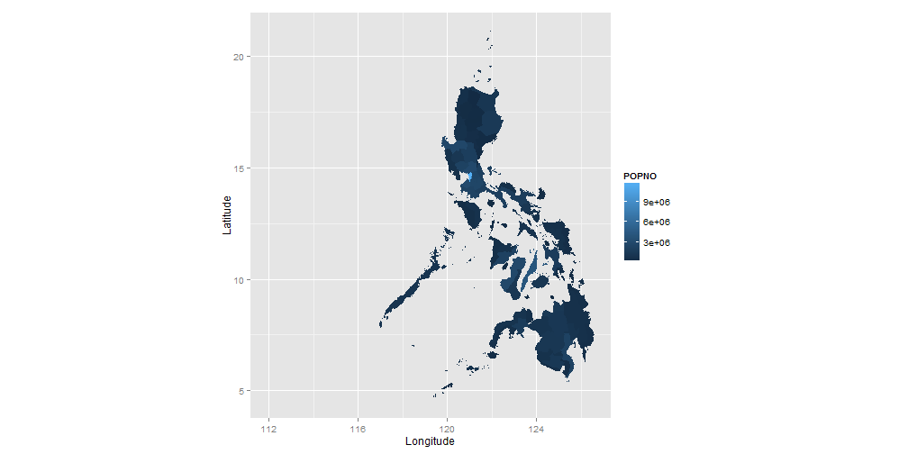
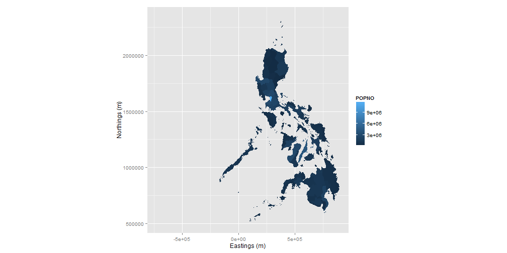
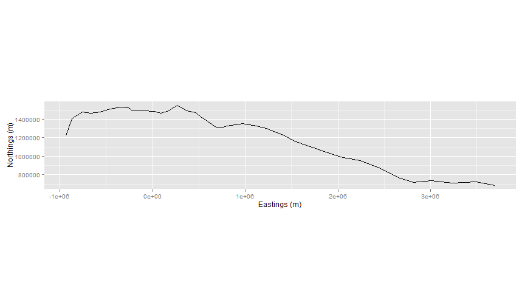
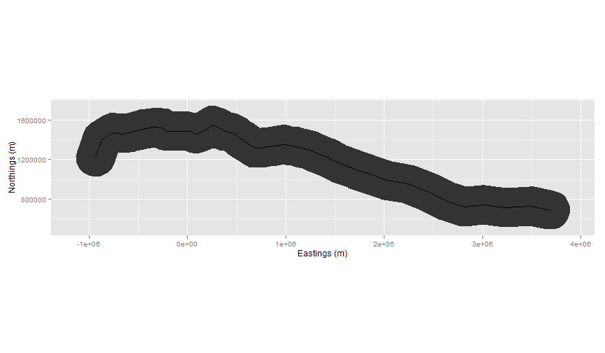
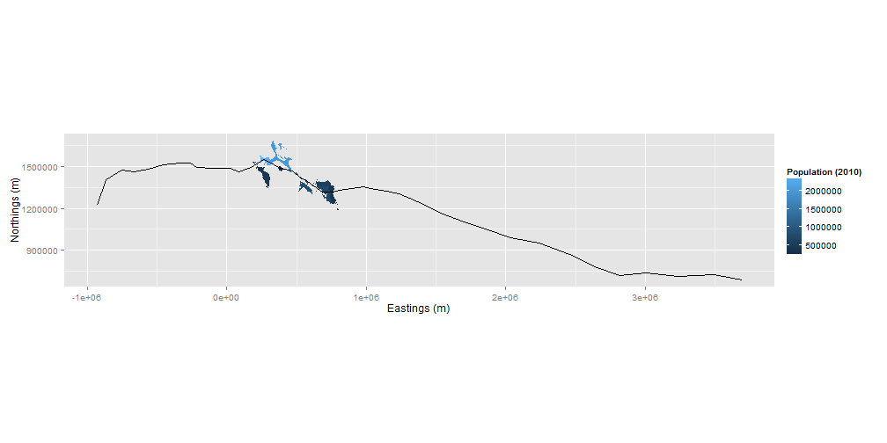
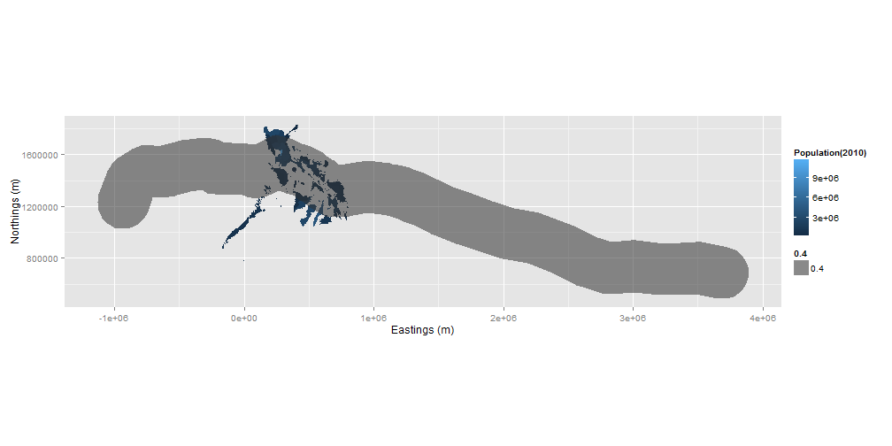

## Geographic Information System

A GIS or Geographic Information System is defined as an integrated collection of computer software and data used to view and manage information about geographic places, analyze spatial relationships, and model spatial processes. A GIS provides a framework for gathering and organizing spatial data and related information so that it can be displayed and analyzed.

<iframe src='gis.gif' width=800px height=spx>
</iframe> 

---

## Packages

Packages used in spatial analysis:


> 1. rgdal - translator library for raster and vector formats
> 2. rgeos - for spatial operations
> 3. maptools - for data handling
> 4. ggplot2 - plotting library


---

## Load spatial data into R

From the maptools package:

1. readShapePoints
2. readShapeLines
3. readShapePoly


---

## Load spatial data into R
# Polygons

```r
# SPATIALPOLYGONSDATAFRAME
provinces <- readShapePoly("PHL_provinces.shp", IDvar="id")
```

 

---

## Load spatial data into R
# Points

```r
# SPATIALPOINTSDATAFRAME
trackpoints <- read.csv("track.csv", header = T)
coordinates(trackpoints) <- c("lng.00", "lat.00")
```
 

---

## Load spatial data into R
# Lines

```r
# SPATIALLINESDATAFRAME
# convert SpatialPointsDataFrame to a list of line class
x <- lapply(split(trackpoints, trackpoints$ID), 
            function(x) Lines(list(Line(coordinates(x))), x$ID[1L]))

# convert list of line class to SpatialLines
tracklines <- SpatialLines(x)
data <- data.frame(id = unique(trackpoints$ID))
rownames(data) <- data$ID

# convert SpatialLines to SpatialLinesDataFrame
tracklines <- SpatialLinesDataFrame(tracklines, data)

# SPATIALLINES
spatiallines <- SpatialLines(list(Lines(list(Line(coordinates(trackpoints))), "1")))
```

---

## Load spatial data into R
# Lines

 

---

## Coordinate Reference System
# WGS 84 - World Geodetic System 1984
 - Latitude/Longitude
 - EPSG 4326

<iframe src='wgs84.gif' width=800px height=250px>
</iframe>

---

## Coordinate Reference System
# UTM - Universal Transverse Mercator
 - units in meters
 - EPSG 32651

<iframe src='UTMzones.jpg' width=800px height=250px>
</iframe>

---

## Coordinate Reference System
# Setting a coordinate reference system

```r
# Select Coordinate Reference System
UTM51N <- CRS("+init=epsg:32651") # UTM Zone 51 N
WGS84 <- CRS("+init=epsg:4326") # LatLong WGS84
```

```r
CRS("+proj=merc +a=6378137 +b=6378137 +lat_ts=0.0 
     +lon_0=0.0 +x_0=0.0 +y_0=0 +k=1.0 +units=m 
     +nadgrids=@null +wktext  +no_defs")
```

---

## Coordinate Reference System
# Set Coordinate Reference System

```r
# Set CRS on provinces spatial data
proj4string(provinces) <- WGS84

# Fortify Lines and Polygons for ggplot2
provinces.f <- fortify(provinces, CM="ID")

# Merge data from polygons to polygons data
provinces.f <- merge(provinces.f, provinces@data, by.x="id", by.y="id")
```


---

## Coordinate Reference System

# Plot polygons with WGS84 CRS
 

---

## Projections
<iframe src='map-projections.jpg' width=800px height=250px>
</iframe>

---

## Projections
# Project from Lat/Long (WGS84) to Mercator (UTM-51N)

```r
# Transform Map Projections
provinces_UTM <- spTransform(provinces, UTM51N)
provinces_UTM.f <- fortify(provinces_UTM, CM="ID")
provinces_UTM.f <- merge(provinces_UTM.f, provinces_UTM@data, by.x="id", by.y="id")
```


---

## Projections

# Plot polygons with UTM Zone 51 N CRS
 

---

## Area Calculation

```r
# Get Area per Province
provincearea <- gArea(provinces_UTM, byid=TRUE)
provincearea <- data.frame(cbind(provincearea, names(provincearea)), row.names=NULL)
names(provincearea) <- c("area", "id")
head(provincearea)
```

```
##               area    id
## 1 3973664475.49684 PH.AB
## 2 1669886466.91593 PH.AK
## 3 2509978898.45008 PH.AL
## 4 2995592657.18506 PH.AN
## 5 3914084734.25807 PH.AP
## 6 2731900657.28037 PH.AQ
```

```r
provinces_UTM@data <- merge(provinces_UTM@data, provincearea, by.x="id", by.y="id")
provinces_UTM.f <- merge(provinces_UTM.f, provincearea, by.x="id", by.y="id")
```

---

## Area Calculation

```r
provinces_UTM.f['POPDENSITY'] <-  as.numeric(provinces_UTM.f$POPNO)/
  as.numeric(as.character(provinces_UTM@data$area))*1000000
head(provinces_UTM.f, 1)
```

```
##      id   long     lat order  hole piece   group PROVINCE HASC_1  POPNO
## 1 PH.AB 284793 1986612     1 FALSE     1 PH.AB.1     Abra  PH.AB 234733
##   REGION             area POPDENSITY
## 1    CAR 3973664475.49684   59.07217
```

---

## Buffer

```r
bufferlines <- gBuffer(spatiallines_UTM, width = 200000.0, joinStyle="ROUND")
bufferlines.f <- fortify(bufferlines, CM="id")
```
 

---

## Buffer

```r
bufferlines <- gBuffer(spatiallines_UTM, width = 200000.0, joinStyle="ROUND")
bufferlines.f <- fortify(bufferlines, CM="id")
```
 

---

## Intersections (gIntersects)

```r
# INTERSECT LINES AND POLYGONS
intersects <- gIntersects(spatiallines_UTM, provinces_UTM, byid=TRUE)
intersectedprovinces <- provinces_UTM[intersects[,1],]
intersectedprovinces.f <- fortify(intersectedprovinces, CM="id")
intersectedprovinces.f <- merge(intersectedprovinces.f, 
                                intersectedprovinces@data, by.x="id", by.y="id")
```

---

## Intersections (gIntersects)

```r
intersects[1:81,]
```

```
## PH.AB PH.AK PH.AL PH.AN PH.AP PH.AQ PH.AS PH.AU PH.BA PH.BG PH.BI PH.BK 
## FALSE FALSE FALSE FALSE FALSE FALSE FALSE FALSE FALSE FALSE FALSE FALSE 
## PH.BN PH.BO PH.BS PH.BT PH.BU PH.CB PH.CG PH.CL PH.CM PH.CN PH.CP PH.CS 
## FALSE FALSE FALSE  TRUE FALSE FALSE FALSE FALSE FALSE FALSE FALSE FALSE 
## PH.CT PH.CV PH.DI PH.DO PH.DS PH.DV PH.ES PH.GU PH.IB PH.IF PH.II PH.IN 
## FALSE FALSE FALSE FALSE FALSE FALSE  TRUE FALSE FALSE FALSE FALSE FALSE 
## PH.IS PH.KA PH.LE PH.LG PH.LN PH.LS PH.LU PH.MB PH.MC PH.MD PH.MG PH.MM 
## FALSE FALSE FALSE FALSE FALSE FALSE FALSE  TRUE  TRUE FALSE FALSE FALSE 
## PH.MN PH.MQ PH.MR PH.MT PH.NC PH.ND PH.NE PH.NR PH.NS PH.NV PH.PL PH.PM 
## FALSE  TRUE FALSE FALSE FALSE FALSE FALSE FALSE  TRUE FALSE FALSE FALSE 
## PH.PN PH.QR PH.QZ PH.RI PH.RO PH.SC PH.SG PH.SK PH.SL PH.SM PH.SN PH.SQ 
## FALSE FALSE  TRUE FALSE FALSE FALSE FALSE FALSE FALSE  TRUE FALSE FALSE 
## PH.SR PH.SS PH.SU PH.TR PH.TT PH.ZM PH.ZN PH.ZS PH.ZY 
## FALSE FALSE FALSE FALSE FALSE FALSE FALSE FALSE FALSE
```

---

## Intersections (gIntersects)
# Plot Line-Polygon Intersection
 

---

## Intersections (gIntersects)
# Plot Line-Polygon Intersection
 

---

## Intersections (gIntersects)

```r
# INTERSECT POLYGONS AND POLYGONS
intersects_200km <- gIntersects(bufferlines, provinces_UTM, byid=TRUE)
intersectedprovinces_200km <- provinces_UTM[intersects_200km[,1],]
intersectedprovinces_200km.f <- fortify(intersectedprovinces_200km, CM="id")
intersectedprovinces_200km.f <- merge(intersectedprovinces_200km.f, 
                                      intersectedprovinces_200km@data, by.x="id", by.y="id")
```

---

## Intersections (gIntersection)


```r
intersection <- gIntersection(bufferlines, provinces_UTM, 
                              byid=TRUE, id=row.names(provinces_UTM@data))
ids <- getSpPPolygonsIDSlots(intersection)
province_intersect <- provinces_UTM@data[row.names(provinces_UTM@data) %in% ids,]
intersection.df <- SpatialPolygonsDataFrame(intersection, province_intersect)
intersection.df$rowid <- row.names(intersection.df)
intersection.f <- fortify(intersection.df, CM="id")
intersection.f <- merge(intersection.f,intersection.df@data, by.x="id", by.y="rowid")
```

---

## Intersections
# Plot Polygon-Polygon Intersection
 

---

## Intersections (gIntersects)
# Plot Polygon-Polygon Intersection 
 

---

## Intersections (gIntersection)
# Plot Polygon-Polygon Intersection 
 

---

 
